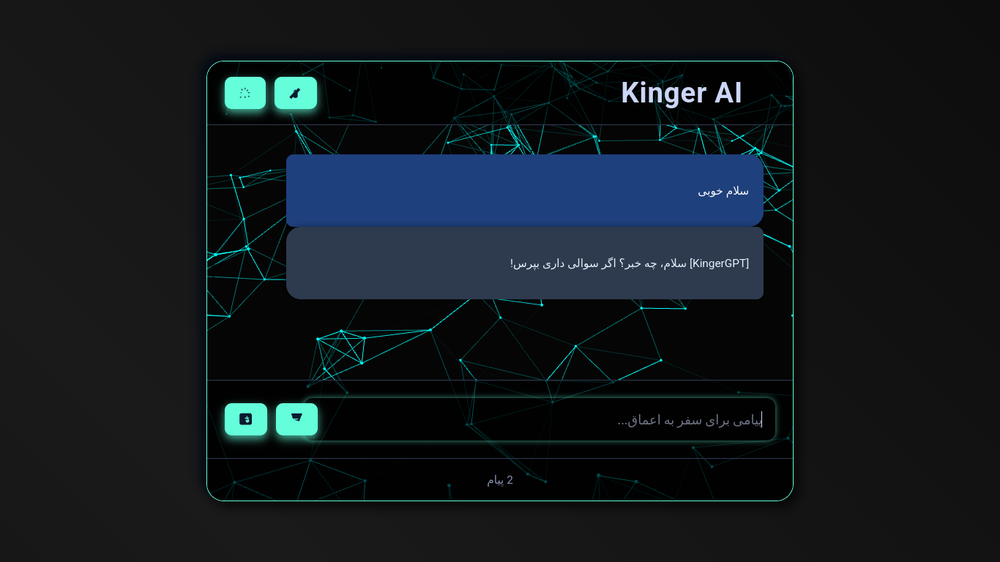

---

# 🤖 Kinger AI - چت‌بات تحت وب با رابط کاربری پیشرفته

**Kinger AI** یک چت‌بات هوش مصنوعی تحت وب است که با استفاده از Flask در سمت سرور و HTML/CSS با طراحی نئومورفیک در سمت کلاینت ساخته شده است. این پروژه یک تجربه مکالمه‌ای زیبا، روان و فارسی‌زبان را در محیطی آینده‌نگر ارائه می‌دهد.

---

## 🚀 ویژگی‌ها

- 🌐 **رابط کاربری تحت وب** زیبا و واکنش‌گرا (Responsive)
- 🧠 **هوش مصنوعی متصل به API** برای پاسخ‌های پیشرفته
- 🎨 پشتیبانی از **ساخت تصویر با هوش مصنوعی**
- 💬 پشتیبانی از زبان فارسی
- 🌗 تغییر تم روشن/تاریک با جلوه‌های بصری مدرن
- 🔄 قابلیت ریست گفتگو
- 🧩 استفاده از فناوری‌های مدرن مانند `VANTA.NET` و `Anime.js` برای افکت‌های پویا

---

## 📁 ساختار پروژه

```
├── kinger.py               # سرور Flask برای پردازش درخواست‌ها
├── templates/
│   └── index.html          # رابط کاربری سمت کلاینت
├── static/
│   └── style.css           # استایل نئومورفیک + حالت شب/روز
```

---

## ⚙️ نحوه اجرا

1. ابتدا مخزن را کلون کنید:
   ```bash
   git clone https://github.com/kingerbd/kingerai.git
   cd kingerai
   ```

2. کتابخانه‌های مورد نیاز را نصب کنید:
   ```bash
   pip install flask flask-session requests
   ```

3. اجرا کنید:
   ```bash
   python kinger.py
   ```

4. مرورگر خود را باز کرده و به آدرس زیر بروید:
   ```
   http://127.0.0.1:5000
   ```

---

## 🧪 پیش‌نمایش

تصویری از رابط کاربری پروژه:



---

## 📦 تکنولوژی‌ها

- Python + Flask
- HTML5 + CSS3 + JavaScript
- Flask-Session برای نگهداری مکالمات
- API‌های خارجی برای تولید پاسخ و تصویر

---

## 📄 مجوز

این پروژه تحت مجوز MIT ارائه شده است. برای اطلاعات بیشتر فایل `LICENSE` را ببینید.

---

## 🙌 مشارکت

در صورت علاقه به بهبود پروژه، فورک کرده، تغییرات خود را اعمال کنید و Pull Request ارسال نمایید.

---

## 👤 توسعه‌دهنده

**kingerbd**  
[ایمیل توسعه‌دهنده - در صورت نیاز این بخش را ویرایش کن]

---

> ساخته شده با ❤️ و یک ذهن تاریک.
```

---
